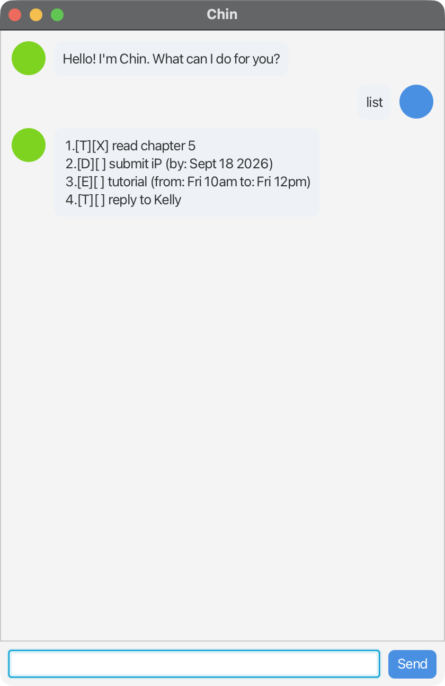

# Chin User Guide

Chin is a small, keyboard-first task chatbot. Give it a to-do, a deadline, or an event; it stores it locally in `data/chin.txt` and shows it back to you in a JavaFX chat window.



## Quick start

1. Ensure you have **JDK 21** (Corretto or Zulu) installed.
2. Download the latest `chin-all.jar` from the [Releases page](https://github.com/xy-241/ip/releases).
3. Put the jar in a folder of its own — Chin will create a `data/` subfolder next to it for saved tasks.
4. Run it:
   ```
   java -jar chin-all.jar
   ```
5. Type commands into the box at the bottom of the window and press **Enter** or click **Send**.

## Features

### Adding a to-do — `todo`

Adds a plain task with no date.

Format: `todo DESCRIPTION`

Example:

```
todo read chapter 5
```

Expected output:

```
Locked in. Added to the pile:
  [T][ ] read chapter 5
You now have 1 task on the list.
```

### Adding a deadline — `deadline`

Adds a task with a due date. Date must be in `yyyy-MM-dd` form.

Format: `deadline DESCRIPTION /by yyyy-MM-dd`

Example:

```
deadline submit iP /by 2026-09-18
```

Expected output:

```
Locked in. Added to the pile:
  [D][ ] submit iP (by: Sep 18 2026)
You now have 2 tasks on the list.
```

### Adding an event — `event`

Adds a task with a start and end time. Start/end can be free-form text.

Format: `event DESCRIPTION /from START /to END`

Example:

```
event tutorial /from Fri 10am /to Fri 12pm
```

### Listing tasks — `list`

Shows every task in insertion order (1-based).

Format: `list`

### Marking / unmarking — `mark` / `unmark`

Marks a task as done (or reverts it).

Format: `mark INDEX` / `unmark INDEX`

Example: `mark 1`

### Deleting a task — `delete`

Removes the task at the given index.

Format: `delete INDEX`

### Finding tasks — `find`

Case-insensitive substring search across every task's display text.

Format: `find KEYWORD`

Example: `find book`

### Sorting by deadline — `sort`

Reorders the list so deadline tasks with the earliest date come first, followed by non-deadline tasks.

Format: `sort`

### Exit — `bye`

Prints a farewell and closes the JavaFX window via `Platform.exit()` after a short pause.

Format: `bye`

## Data file

Tasks live in `data/chin.txt` next to the jar. Each line is a pipe-separated record such as `D | 0 | submit iP | 2026-09-18`. The file self-heals: unparseable lines (bad dates, wrong shape) are silently skipped on the next load.

## Command summary

| Action | Command |
|---|---|
| Add to-do | `todo DESCRIPTION` |
| Add deadline | `deadline DESCRIPTION /by yyyy-MM-dd` |
| Add event | `event DESCRIPTION /from START /to END` |
| List all | `list` |
| Mark / unmark | `mark N` / `unmark N` |
| Delete | `delete N` |
| Find | `find KEYWORD` |
| Sort by deadline | `sort` |
| Quit | `bye` |
